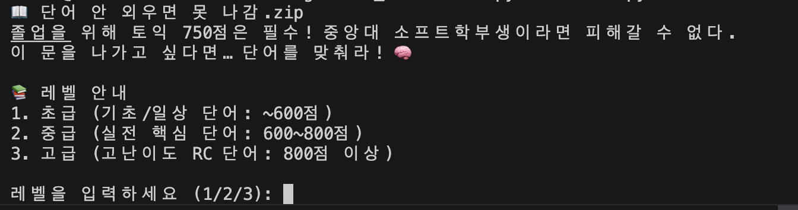
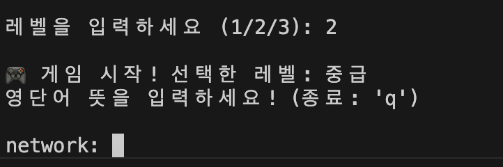
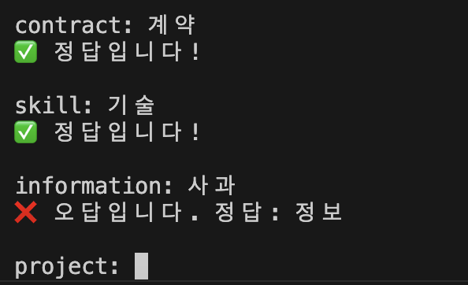
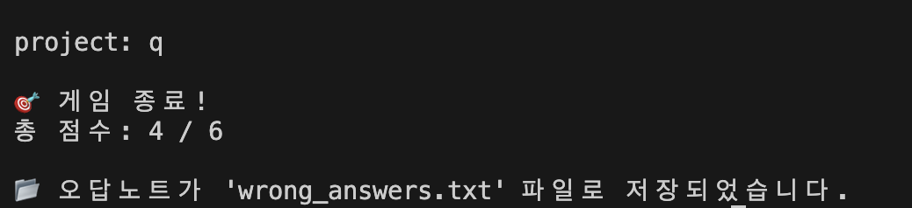
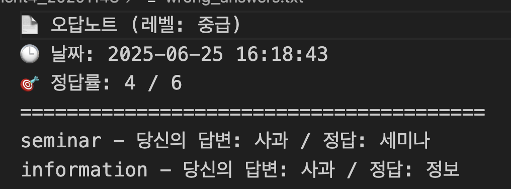

# 📖 단어 안 외우면 못 나감.zip

중앙대 소프트학부생을 위한 토익 영단어 콘솔 퀴즈 프로그램!  
이 문을 나가고 싶다면… 단어를 맞춰라! 🧠  
토익 졸업 요건? 단어만 알면 OK!

---

## 🎯 프로그램 소개

본 프로그램은 사용자가 **레벨을 선택**하고, 해당 레벨의 **토익 빈출 단어**를 맞히는 콘솔 기반 퀴즈입니다.

- 단어는 **초급, 중급, 고급**으로 구성되어 있으며 총 **150개**!
- 한 번 시작하면 `q`를 누르기 전까지 계속됩니다!
- 틀린 단어는 자동으로 **오답노트에 저장**됩니다.
- 맞히면 점수 UP! 실시간 피드백 제공!

---

## 🗂️ 레벨 구성

| 레벨 | 설명 | 예상 점수대 |
|------|------|-------------|
| 1 (초급) | 일상/기초 단어 중심 | 400~600점 |
| 2 (중급) | 직장/업무 용어 위주 | 600~800점 |
| 3 (고급) | 고난이도 RC 빈출 어휘 | 800~900+점 |

---

## 📦 파일 구조

```
toeic_word_quiz/
├── main.py           # 메인 실행 파일
├── words.json        # 단어 데이터 (총 150개)
└── wrong_answers.txt # (자동 생성) 오답 저장
```

---

## ▶️ 실행 방법

1. Python 3 설치 필요
2. 터미널에서 다음 명령어 실행:

```bash
python main.py
```

3. 레벨 선택 → 단어 퀴즈 시작!

---

## 💡 프로그램 출력 화면


<br>

<br>

<br>

<br>

---

## 📝 오답노트 기능

틀릴 경우 자동으로 `wrong_answers.txt` 파일에 저장됩니다.


<br>

---

